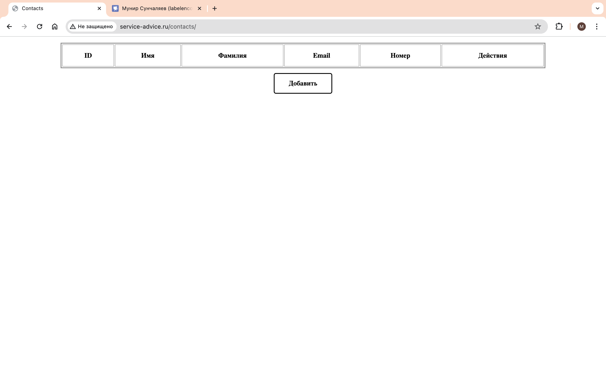

# Контакты
Сервис с встроенной БД развернут на Raspberry pi 4 
и доступен по адресу https://service-advice.ru/contacts.

Применяемые технологии: Java17, Maven, Spring Boot Web, Thymeleaf, Spring Data JDBC, Spring Boot Test, 
H2, PostgreSQL, HTML, CSS, Docker, Docker Compose.

## Требования
Реализуйте небольшое консольное приложение «Список контактов». 
Интерфейс приложения должен быть реализован с помощью Thymeleaf,
обработка запросов должна происходить через контроллеры Spring MVC.
Сущность «Контакт» должна представлять из себя идентификатор (id),
имя (firstName), фамилию (lastName), почту (email) и телефон (phone).

Приложение должно:

- выводить все контакты в таблице. Выводиться должны все поля сущности.
- добавлять новый контакт через форму. ID не должен добавляться через UI.
- редактировать существующие контакты через форму. ID не должен меняться.
- удалять конкретный контакт через кнопку в списке контактов.

## Реализация
Сервис имеет свой UI. Он состоит из [главной страницы](src/main/resources/templates/index.html) с которой возможен просмотр всех контактов,
добавление или изменение контактов, а также их удаления. Для добавления и изменения выполняется редирект
на [страницу с формой](src/main/resources/templates/pages/save_page.html); после нажатия кнопки "Отправить" производится редирект на главную страницу.

Для слоя с данными написаны [юнит-тесты](src/test/java/com/munsun/contact_service/dao/ContactDaoImplUnitTests.java).

## Запуск
### Запуск со встроенной БД
Перейти в корень, собрать проект...
```
mvn clean package -DskipTests=true
```
и запустить:
```
java -jar target/Contacts-0.0.1-SNAPSHOT.jar
```
Для выхода на главную страницу перейти на http://localhost:8080/contacts.

### Запуск с postgres:
Запуск образов:
```
docker compose up
```

## Примеры запуска
Переход на главную страницу


Создание контакта


Проверка создания контакта


Изменение контакта


Проверка изменения контакта


Удаление контакта
